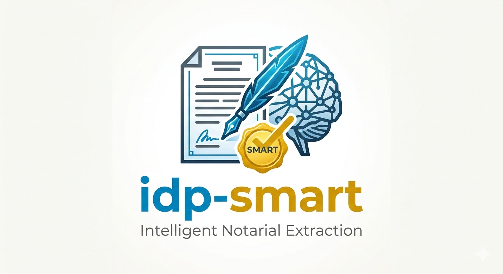
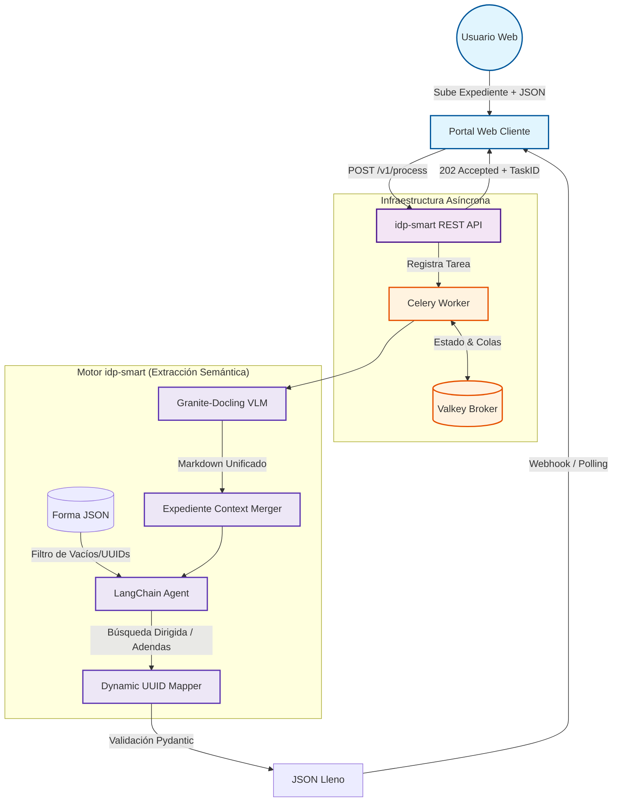

# idp-smart: Intelligent Document Processing

<p align="center">
  
</p>

> **El puente entre documentos legales complejos y datos estructurados.**

## 📝 Descripción del Proyecto

**idp-smart** es un motor de inteligencia artificial de alto rendimiento diseñado para la extracción semántica y el llenado automatizado de formas precodificadas (JSON). El sistema procesa expedientes complejos y **dinámicos** (Escrituras, Actas, RFC), permitiendo la inserción de documentos adicionales (**Adendas o Anexos**) para completar campos faltantes sin perder la información ya validada.

Está diseñado para integrarse mediante **API REST** a aplicaciones web, automatizando el flujo desde el documento físico hasta el dato validado en los campos `value` de las formas registrales y notariales.

---

## 🏗️ Arquitectura de Solución (End-to-End)

El sistema opera de forma asíncrona, separando la recepción de documentos del procesamiento pesado de IA.



---

## 🔍 Funcionalidades Clave

* **Agnóstico a la Forma:** El sistema lee dinámicamente cualquier JSON (como `bi34.json`) y utiliza los `labels` para saber qué extraer sin necesidad de programar cada una de las 100+ formas.
* **Procesamiento de Adendas:** Capacidad de recibir documentos adicionales para completar campos que quedaron vacíos en una primera etapa, preservando los datos ya existentes.
* **Mapeo por UUID:** Los datos extraídos se inyectan directamente en el campo `value` del JSON original utilizando los identificadores únicos (UUID) del sistema cliente.
* **Visión Jerárquica:** Gracias a **Granite-Docling**, el sistema entiende tablas, sellos y la estructura legal de los documentos, no solo el texto plano.

---

## ⚙️ Flujo de Datos y Especificaciones de Desarrollo

### 1. Gestión de Tipos de Acto y Formas (JSON)
* El **tipo de acto** se administra centralizadamente a través del catálogo transaccional `ctactos`.
* Este catálogo está ligado a la tabla `cfdeffrmpre`, lugar donde se almacena el JSON precodificado dentro de la columna `jsconfforma`.
* Para que el procesamiento inicie, es obligatorio pasar el **tipo de acto** o el **nombre del acto**. Los atributos clave obtenidos de `ctactos` son el nombre corto (`dsactocorta`) y la descripción detallada (`dsacto`).

### 2. Interfaz de Usuario (Frontend)
* Se construirá un Frontend para facilitar la operación del motor de IA a los usuarios finales.
* El Frontend incluirá una zona para la **carga de archivos** (permitiendo subir uno o múltiples documentos, cubriendo expedientes y adendas).
    * **Formatos de Entrada:** El sistema permite la selección de una amplia variedad de formatos fuente (**Imágenes, Documentos de Office y PDF nativos/escaneados**).
    * **Estandarización:** Todos los archivos de imagen u Office **deberán ser convertidos o unificados a formato PDF** desde el propio Frontend o desde su paso por la API antes de ser subidos al bucket de almacenamiento (MinIO) de manera definitiva, asegurando compatibilidad unánime con el motor de visión Docling.
* Contará con un selector conectado a la base de datos para que el usuario **seleccione el tipo de acto** que se procesará y llenará.

### 3. API REST y Documentación Swagger
* Toda la funcionalidad estará disponible como servicio mediante la API REST de **idp-smart**.
* La API y sus endpoints (como `/v1/process`, `/v1/status` y las consultas de catálogos) **deberán estar correctamente documentadas utilizando Swagger** (OpenAPI provisto nativamente por FastAPI).
* Esto asegurará que los consumidores puedan probar contratos, envíos de archivos Multipart e inyecciones JSON sin problemas.

---

## 📁 Estructura del Proyecto

```text
idp-smart/
├── assets/                  # Directorio de recursos gráficos y logos
│   └── logo.png             # Logo principal de idp-smart
├── docker-compose.yml       # Orquestador para Valkey, MinIO, API y Worker
├── Dockerfile               # Imagen lista para producción (API y Celery Worker)
├── requirements.txt         # Dependencias (FastAPI, Celery, SQLAlchemy, Minio, etc.)
└── app/
    ├── main.py              # Punto de entrada de la aplicación FastAPI (REST API)
    ├── core/
    │   ├── config.py        # Gestión de configuraciones (BD, MinIO y Valkey)
    │   └── minio_client.py  # Funciones utilitarias para interactuar con MinIO (Object Storage)
    ├── db/
    │   ├── database.py      # Configuración de conexión asíncrona a SQLAlchemy
    │   └── models.py        # Modelo SQLAlchemy (DocumentExtraction) para almacenar información de formas
    ├── engine/              # Lógica central de procesamiento de IA
    │   ├── agent.py         # Módulo LangChain Agent para mapear texto extraído al esquema JSON
    │   ├── mapper.py        # Lógica para extraer esquemas de formas y mapear el UUID final
    │   └── vision.py        # Implementación de Granite-Docling Document Converter
    └── worker/
        └── celery_app.py    # Lógica de tareas asíncronas de Celery para procesamiento de documentos
```

---

## 🏗️ Componentes de Infraestructura Adicionales

* **PostgreSQL (`idp_qa` local host)**: Rastrea las cargas de formas, Tipo de Acto, ID de Forma y JSON extraídos utilizando modelos de SQLAlchemy.
* **MinIO (Compatible con S3)**: Desplegado automáticamente a través de `docker-compose` para aislar los archivos PDF crudos y en procesamiento. Cuando la API REST recibe un documento, persiste el PDF/Imágenes en el bucket `idp-documents` de MinIO en lugar de usar un sistema de archivos estándar, lo que permite la escalabilidad horizontal.
* **Valkey Broker**: Asegura que las tareas de Celery se encolen correctamente para la extracción de texto compleja mediante PLN.

---

## 🚀 Instalación y Ejecución

1. **Inicia el entorno** usando Docker Compose:
   ```bash
   cd /home/casmartdb/.gemini/antigravity/scratch/idp-smart
   docker compose up -d --build
   ```

2. **Verifica los servicios**:

   - **Obtener Formas**: Obtén las formas dinámicas válidas desde `cfdeffrmpre`:
     ```bash
     curl http://localhost:8000/api/v1/forms
     ```
   
   - **Procesar Documento**: Envía una tarea de extracción. Con los cambios más recientes, debes enviar los campos de texto `act_type` y `form_code` dentro del formulario de la petición:
     ```bash
     curl -X POST http://localhost:8000/api/v1/process \
          -F "act_type=Escritura" \
          -F "form_code=FORMA_1234" \
          -F "json_form=@form.json" \
          -F "document=@document.pdf"
     ```
   
   - **Revisar estado de extracción**: Consulta la base de datos (PostgreSQL) directamente para obtener el estado de una tarea lanzada previamente vía ID:
     ```bash
     curl http://localhost:8000/api/v1/status/TU_ID_DE_TAREA
     ```

## ⚙️ Configuraciones de Entorno (`host.docker.internal`)

El archivo `docker-compose.yml` configura explícitamente el puente de red al host:
* `DB_HOST=host.docker.internal` maneja la conectividad entre las aplicaciones de Python dentro de Docker y tu servidor físico PostgreSQL en `localhost:5432` (evitando la necesidad de aprovisionar una BD separada dentro de Docker mientras mantienes la API en contenedores).

MinIO se ejecuta mapeado directamente a los puertos `9000` (API) y `9001` (Panel web o consola). Puedes acceder a la interfaz web local de MinIO en `http://localhost:9001` con las credenciales `admin / minio_password123`.

---

## 🛠️ Requerimientos de Infraestructura (Alto Rendimiento)

### 1. Servidor de Producción (Recomendado)

* **CPU:** Intel Xeon Gold o AMD EPYC (**16 núcleos físicos**). Soporte obligatorio para **AVX-512**.
* **Memoria RAM:** **64 GB DDR5 ECC**. Permite procesar múltiples expedientes largos en paralelo.
* **GPU (Aceleración):** **NVIDIA RTX A4000 (16GB VRAM)** o superior. Crítico para reducir el tiempo de visión artificial en un 80%.
* **Almacenamiento:** Arreglo **NVMe Gen4** (Lectura > 5000 MB/s).
* **Red:** Conectividad de 1 Gbps simétrica.

### 2. Estación de Trabajo del Desarrollador (Workstation)

* **CPU:** **Intel Core i9 o AMD Ryzen 9** (12 núcleos+).
* **Memoria RAM:** **32 GB mínimo**.
* **GPU:** **NVIDIA RTX 3060 (12GB)** o superior para pruebas locales de inferencia.
* **SO:** Linux (Ubuntu 22.04+) o Windows con **WSL2**.
* **Herramientas:** Docker Desktop, VS Code, Valkey-CLI y Python 3.11+.

---

## 👨💻 Perfil de Ingeniería Requerido

El equipo de desarrollo debe dominar el siguiente stack para la evolución de **idp-smart**:

* **Core:** Python 3.11 (Asincronismo, Pydantic, FastAPI).
* **AI:** LangChain (Orquestación de Agentes) y Prompt Engineering.
* **Backend:** Celery para tareas de larga duración y Valkey para gestión de estados de alta velocidad.
* **DevOps:** Docker para replicación de entornos y despliegue de microservicios.

---

## 🛡️ Justificación del Stack Tecnológico

A diferencia de soluciones comerciales cerradas (SaaS), este stack ofrece:

1. **Soberanía de Datos:** Procesamiento privado de documentos notariales sensibles.
2. **Mapeo Semántico Dinámico:** Entiende labels humanos para llenar campos técnicos.
3. **Flexibilidad Notarial:** Diseñado para la realidad legal donde los expedientes crecen mediante adendas y anexos.
4. **Escalabilidad Asíncrona:** Arquitectura lista para crecer horizontalmente según la demanda de trámites.

---

**idp-smart** representa la evolución del procesamiento de documentos, transformando la revisión manual en una validación estratégica asistida por IA.
